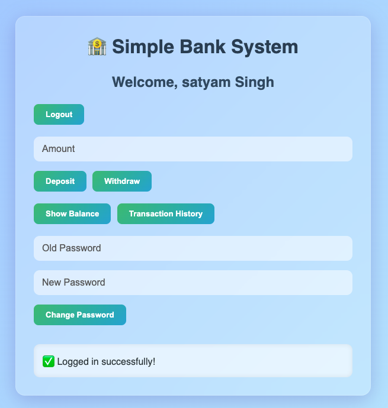
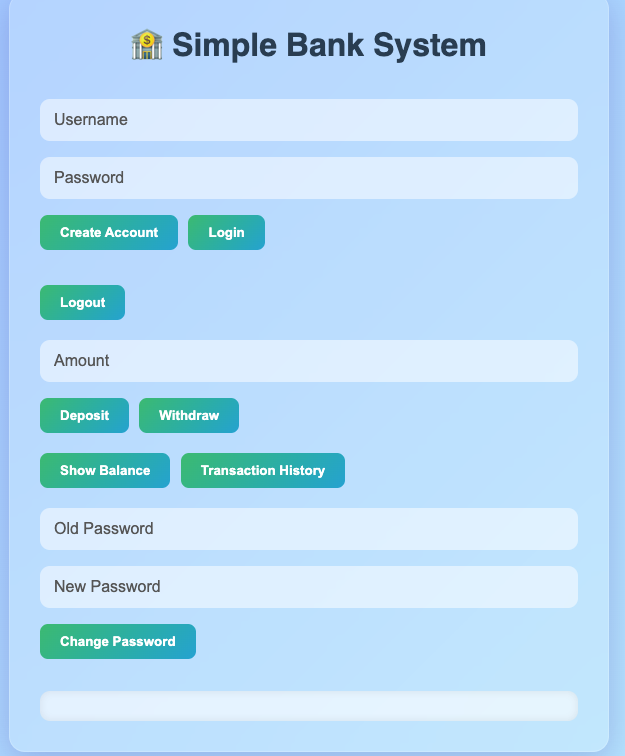

# 🏦 Bank System Web App

A **beautiful and interactive Bank System** built with **HTML, CSS, and JavaScript**, where users can:
- Create an account
- Login/logout
- Deposit and withdraw money
- Check balance
- View transaction history
- Change password

✨ Styled with modern **glassmorphism** and animated UI using **Font Awesome** icons.

---

## 📸 Screenshots


| Auth Section | Dashboard |
|--------------|-----------|
|  |  |

---

## 🚀 Live Demo

> _Coming soon!_ (Deploy on GitHub Pages, Netlify, or Vercel)

---

## 🧰 Tech Stack

- **HTML5**
- **CSS3** (Glassmorphism UI)
- **Vanilla JavaScript**
- **Font Awesome** for icons

---

## 🎯 Features

✅ Create a bank account  
✅ Secure login system  
✅ Deposit / Withdraw funds  
✅ View current balance  
✅ View full transaction history  
✅ Change password  
✅ Logout  
✅ Fully responsive UI  
✅ Icon-enhanced visual feedback

---

## 🛠️ How to Run Locally

1. **Clone this repo**
   ```bash
   git clone https://github.com/your-username/bank-system-web.git
   cd bank-system-web
